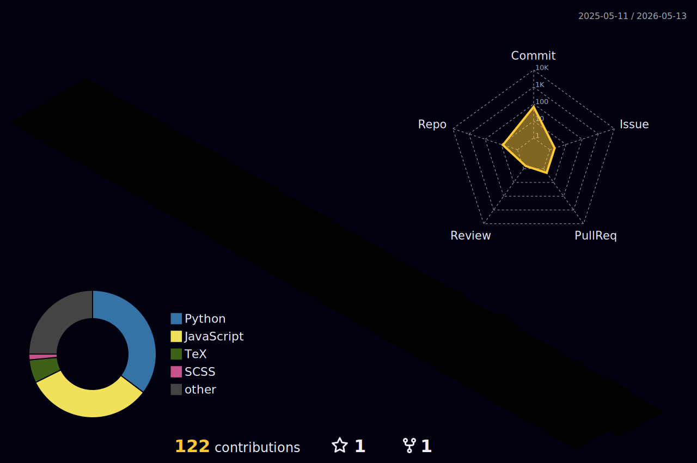

  

 

  <table width="100%" cellspacing="0" cellpadding="0">
    <tr>
      <td width="35%" align="center" valign="top">
        
      </td>
      <td width="65%" valign="middle">
          
        

          <b>「写代码是件简单的事，</b>
        

        

          <b>把事情做简单才是本事。」</b>
        

         
        

          代码如人生，删繁就简。
        

          
      </td>
    </tr>
  </table>

 

  

 

<h3 align="center">
  <samp>🛠️ &nbsp;Tech&nbsp;Stack</samp>
</h3>

  

 

<h3 align="center">
  <samp>🎯 &nbsp;Now&nbsp;Focusing</samp>
</h3>

  <table>
    <tr>
      <td align="center" width="50%">
        <b>💻 Touch Bar Custom Software</b>
         
        <i>正在打造</i>
         
        <a href="https://github.com/Tangzishun-Li/LyricsMTMR">LyricsMTMR →</a>
      </td>
      <td align="center" width="50%">
        <b>🧠 LeetCode + Deep Learning</b>
         
        <i>刷算法底层逻辑，啃深度学习源码</i>
      </td>
    </tr>
  </table>

 

<h3 align="center">
  <samp>📦 &nbsp;Projects</samp>
</h3>

  <table>
    <tr>
      <td align="center" width="50%">
        
         
        macOS Touch Bar 自定义工具 · Swift
      </td>
      <td align="center" width="50%">
        
         
        Your guide to playing hooky · Swift
      </td>
    </tr>
    <tr>
      <td align="center" width="50%" colspan="2">
        
         
        全新项目 · JavaScript
      </td>
    </tr>
  </table>

 

<h3 align="center">
  <samp>📊 &nbsp;GitHub&nbsp;Stats</samp>
</h3>

  
  &nbsp;&nbsp;
  

 

  

 

  

 

  

